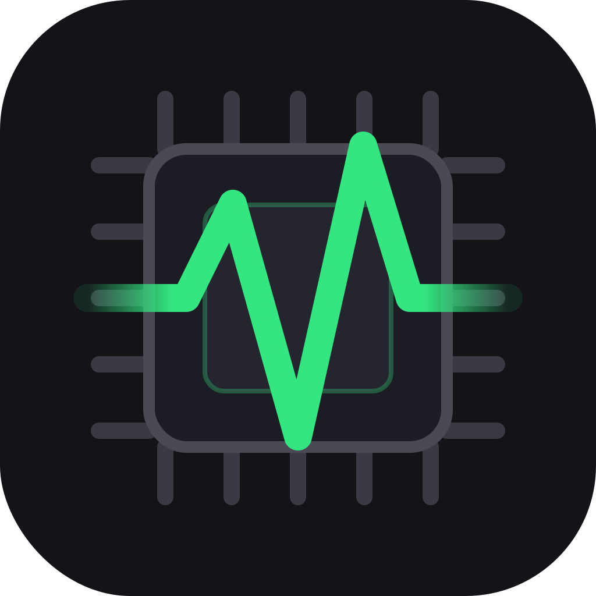

<div align="center">
  

  <h1>SystemPulse</h1>

  <b>Advanced System Diagnostic & Monitoring Tool for macOS</b>

  <br/><br/>

  <a href="#overview">Overview</a> •
  <a href="#features">Features</a> •
  <a href="#installation">Installation</a> •
  <a href="#notes">Notes</a>

  <br/><br/>

  
  
  
  
  
</div>

---

## Overview

SystemPulse is a lightweight menu bar application for macOS that gives you a real-time pulse of your machine's health — directly from the menu bar, without opening any heavy dashboard.

Built entirely in Swift and SwiftUI, SystemPulse reads data straight from Apple's low-level APIs (IOKit, SMC, CoreMediaIO, Darwin) with no third-party dependencies. It is designed to be fast, unobtrusive, and accurate.

> Click the menu bar icon at any time to see a full breakdown of your system's current state.

---

## Features

- **Battery Health** — displays current charge percentage, max capacity vs. design capacity, and cycle count via IOKit (`AppleSmartBattery`).
- **System Memory** — monitors total, used, active, wired, compressed, and free RAM across the entire system.
- **GPU Usage** — reads GPU utilization (renderer & tiler), VRAM used/total, and GPU name via IOKit (`IOAccelerator`).
- **Network Speed** — shows live download/upload speed in Mbps, summing all physical network interfaces.
- **Fan Speed (SMC)** — reads fan RPM directly from the System Management Controller (SMC).
- **System Lag** — measures main-thread responsiveness with a high-frequency timer to detect system slowdowns.
- **Process List** — lists top processes by CPU and memory usage, with PID and app name.
- **Heavy Files Scanner** — scans your disk for the largest files and shows them in a dedicated panel.
- **Camera In Use** — detects if any process is currently using the camera via CoreMediaIO.
- **Purge RAM** — triggers a system RAM purge (`/usr/sbin/purge`) with administrator privileges.

---

## Requirements

- macOS 13 (Ventura) or later
- Swift 5.9+ (Xcode 15+ or Swift toolchain)

---

## Installation

1. Clone this repository:

   ```bash
   git clone https://github.com/Wenderson-Oscar/system-pulse.git
   cd system-pulse
   ```

2. Build the app bundle:

   ```bash
   ./build_app.sh
   ```

3. Move the app to your Applications folder:

   ```bash
   mv SystemPulse.app /Applications/
   ```

4. Open it:

   ```bash
   open /Applications/SystemPulse.app
   ```

The app will appear in the top menu bar. Click the icon to see the detailed panel.

---

## Notes

- Battery health is calculated as `MaxCapacity / DesignCapacity * 100`.
- GPU usage is system-wide; per-process GPU usage is not available via public macOS APIs.
- Network speed sums all physical interfaces (excludes `lo`, `utun`, `awdl`, `llw`).
- RAM purge requires administrator privileges and triggers a system prompt.
- Fan speed is read-only; writing fan speeds is intentionally unsupported to avoid hardware damage.
